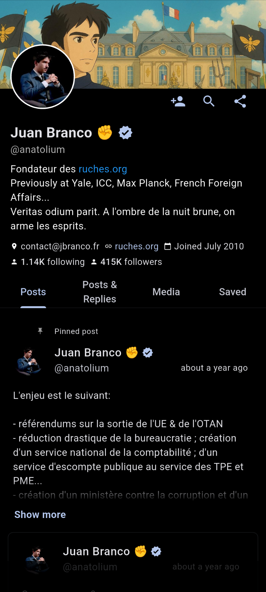
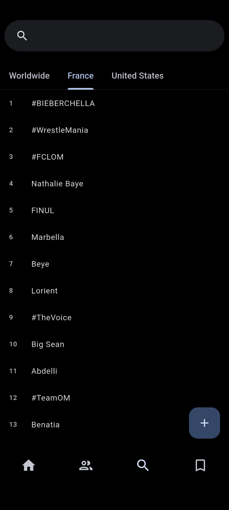

 
 <h1 align="center">QuaX</h1>

Free & open source, tracker-less X client

  
  

  
  
  

## Features

- ✅ Customizable feeds
- ✅ Follow anybody
- ✅ Trendings from anywhere in the world
- ✅ Search anything on X
- ✅ Save posts offline
- ✅ Download any media (image, gif, video)
- ✅ Modern Material 3 design
- ✅ No trackers

> [!NOTE]
> An X account is needed to use the app. Followings and all other QuaX settings are independant from you account.

**Supported for Android 7.0+.**

## Screenshots

  
  
  

## Contribute

If you'd like to help make QuaX even better, here are a few ways you can contribute:

- **Report a bug:** If you've found a bug in QuaX, open a [new issue](https://github.com/teskann/quax/issues/new) (please check that someone else hasn't reported it first).
- **Request a feature:** Feel like something is missing? [Open an issue](https://github.com/teskann/quax/issues/new) detailing exactly what you're looking for.
- **Fix a bug:** To contribute to the codebase, check for issues labeled "good first issue". Otherwise, feel free to tackle any issue, fork the repository, push to a branch, and create a pull request.

## Star History
