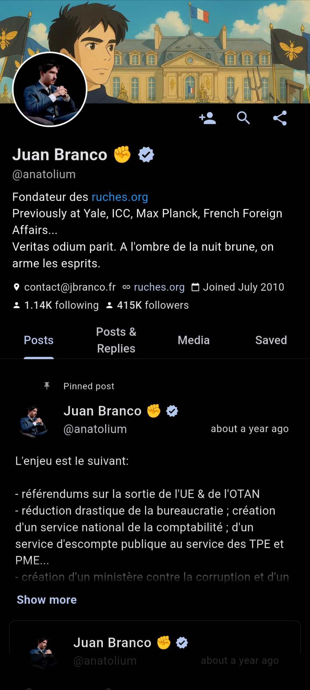
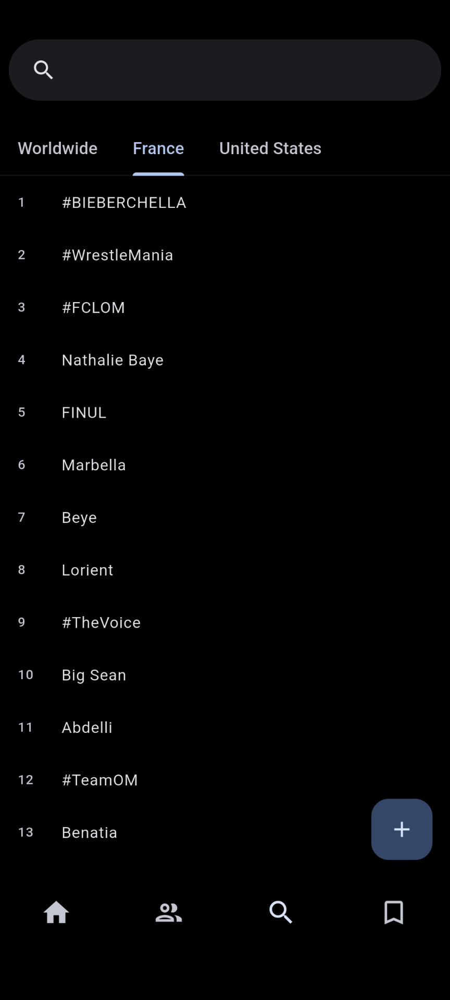

<div align="center">


# QuaX

[](https://github.com/teskann/quax/releases)
[](/LICENSE)
[](https://github.com/teskann/quax/actions)

[](https://github.com/teskann/quax/releases)


**QuaX** is a free, open-source, privacy-focused client for X (formerly Twitter). It is forked
from [Quacker](https://github.com/TheHCJ/Quacker)
and [Fritter](https://github.com/jonjomckay/fritter), and serves as an alternative
to [Squawker](https://github.com/j-fbriere/squawker).

[](https://github.com/teskann/quax/releases)
[](https://apps.obtainium.imranr.dev/redirect.html?r=obtainium://add/https://github.com/Teskann/QuaX)

To verify the downloaded APK, use [these signing certificate fingerprints](./certificate-fingerprints.txt).

[Why isn't QuaX available on F-Droid?](./docs/QuaX.md#why-isnt-quax-available-on-f-droid)

</div>

## Features

> [!IMPORTANT]
> An X account is needed to use QuaX. Subscriptions, saved posts, and all other QuaX settings are
> independent from the account you're logged into. Everything is local to the app.

- ✅ Follow anybody
- ✅ Group your subscriptions in feeds to organize your timeline
- ✅ Trending topics from anywhere in the world
- ✅ Search anything on X
- ✅ Save posts offline
- ✅ Download any media (image, gif, video)
- ✅ Read X articles
- ✅ Modern Material 3 design
- ✅ No trackers

## Screenshots

<p float="left">
  
  
  
</p>

## More information

- [FAQ](./docs/QuaX.md)
- [LICENSE](./LICENSE)
- [Contributing](./CONTRIBUTING.md)
- [Changelog](./changelog.md)

## Build locally

Prerequisites:

- Python
- [FVM](https://fvm.app/) (Flutter Version Management)

The Flutter SDK version is pinned in [`.fvmrc`](./.fvmrc) and provisioned by FVM, so every build uses the exact same toolchain.

```bash
# Install the pinned Flutter SDK and activate it for this project
fvm install
fvm use

# Generate launcher icon assets
python -mvenv .venv
bash -c '
  source ./.venv/bin/activate
  pip install -r requirements.txt
  python generate_icons.py
'

# Run all build steps through fvm so the pinned SDK is used
fvm flutter pub get
fvm dart run flutter_launcher_icons
fvm dart run dart_pubspec_licenses:generate
fvm dart run intl_utils:generate
fvm dart run flutter_iconpicker:generate_packs --packs material
fvm flutter build apk --debug
```

Of course, you can work with this app on Android Studio.

## Star History
<a href="https://www.star-history.com/#teskann/quax&type=date&legend=top-left">
 <picture>
   <source media="(prefers-color-scheme: dark)" srcset="https://api.star-history.com/svg?repos=teskann/quax&type=date&theme=dark&legend=top-left" />
   <source media="(prefers-color-scheme: light)" srcset="https://api.star-history.com/svg?repos=teskann/quax&type=date&legend=top-left" />
   
 </picture>
</a>